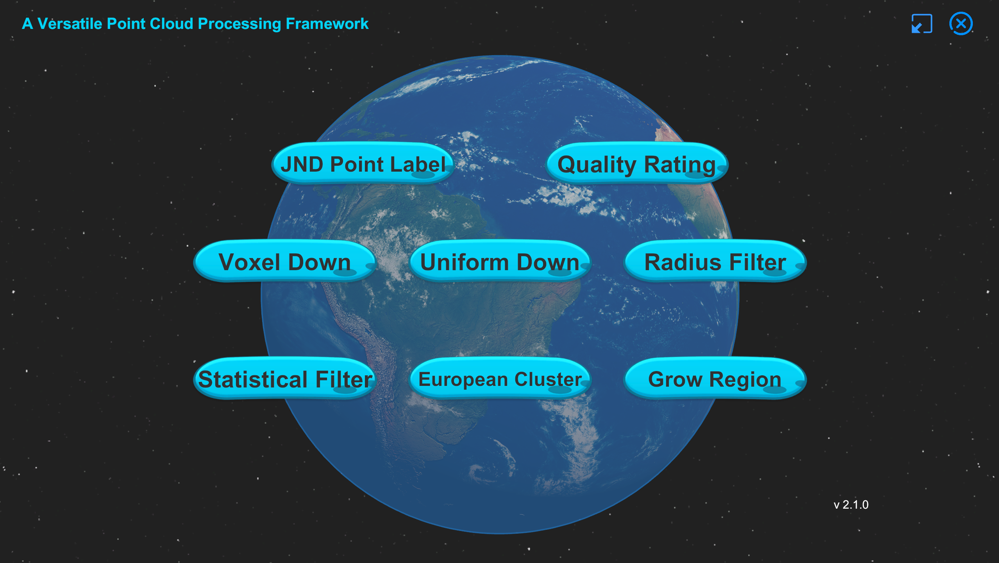
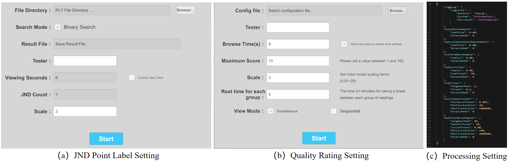
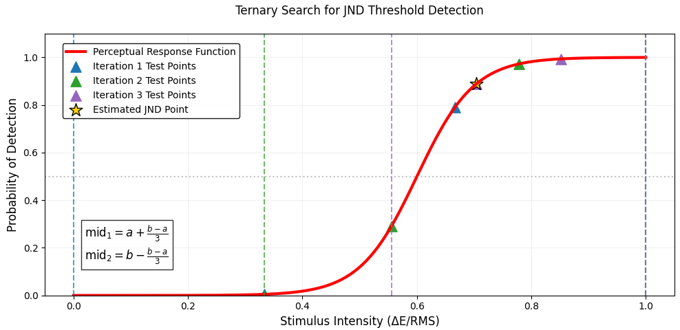
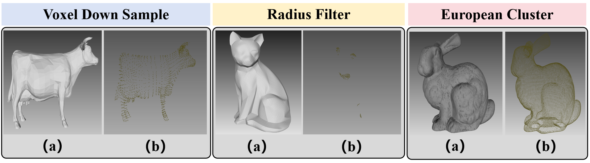

# A Versatile Point Cloud Processing Framework

#### We appreciate any useful suggestions for improvement of this paper from peers. Please raise issues or send an email to **liangxie@stu.pku.edu.cn**. Thanks for your cooperation!

Software download path：
链接: https://pan.baidu.com/s/1UfaKf0rEDuy8zML1CohAwA?pwd=bp45 提取码: bp45

 

Point cloud technology has gained increasing prominence in critical applications such as 3D vision and autonomous driving systems. However, two fundamental challenges hinder its further advancement. First, the current quality assessment framework lacks comprehensive subjective evaluation metrics, particularly human visual perception-based quality scoring and Just Noticeable Difference (JND) annotation data. Second, existing fundamental algorithms for point cloud processing demonstrate significant limitations in robustness and adaptability. To address these challenges, we present OpenVPC, a versatile point cloud processing platform featuring three innovative components: (1) A JND annotation module supporting dual-stimulus point cloud input, enabling simultaneous visualization of original and distorted point clouds for precise JND identification. (2) A subjective quality assessment system implementing a standardized 10-point scoring mechanism for systematic visual quality evaluation. (3) An integrated preprocessing toolkit incorporating advanced algorithms for sampling, filtering, and clustering operations. We conduct extensive validation experiments involving 51 independent evaluations across five representative point cloud datasets. Through rigorous cross-validation analysis, our results demonstrate that OpenVPC achieves exceptional annotation reliability and maintains stable algorithmic performance. These findings confirm the platform's effectiveness in addressing current limitations in point cloud quality assessment and processing. 

# Configurable

 

Configurable software interfaces with adjustable parameter options across the three sub-platforms.

# JND Annotation Sub-platform

 

The ternary search algorithm serves as an efficient extremum search method, particularly suitable for locating critical points in unimodal functions. When applied to just-noticeable difference (JND) detection, this algorithm systematically narrows the search range to determine the perceptual threshold where stimuli become noticeably distinct. The algorithm takes as input an initial interval of stimulus intensity (luminance variation range [0,100]) and outputs the inflection point of perceptual response, namely the JND threshold. This process relies on a fundamental assumption: the perceptual response curve exhibits unimodal characteristics, typically manifesting as a sigmoidal. During implementation, the algorithm first initializes search boundaries by setting minimum a and maximum b stimulus intensities, along with a convergence threshold. 

# JND Prediction Based on Ternary Search

# Quality Rating Sub-platform

 

The point cloud quality rating subsystem builds upon the core workflow of traditional subjective scoring systems while innovatively introducing a point cloud-text bimodal fusion evaluation framework, making it a critical component of the AIGC multimodal quality assessment system~\cite{cao2025agav}. Compared with conventional unimodal evaluation approaches, this system significantly enhances the dimensional completeness and semantic precision of quality assessment through the synergistic analysis of point cloud data and textual descriptions.
Specifically, the system employs cross-modal semantic consistency verification to effectively identify logical conflicts in content generation. It adopts a multi-level quality evaluation architecture that combines geometric distortions (\eg, uneven point density) with semantic distortions (\eg, missing key objects) to establish a comprehensive assessment model. For typical application scenarios like metaverse content generation and high-definition maps for autonomous driving, the system features customized point cloud-text association rules. Experimental results demonstrate that incorporating textual modality improves the detection rate of semantically relevant issues in point cloud quality assessment by 47\%, with particularly outstanding performance in suppressing hallucination generation in complex scenes.

# Preprocess Result

Point cloud preprocessing results: (a) shows the raw data, while (b) displays the processed data after algorithm.

